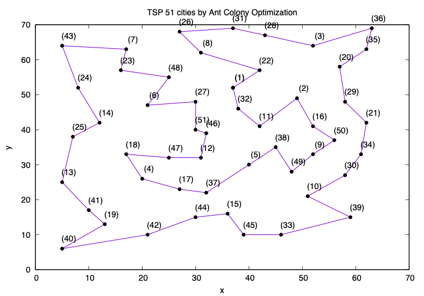
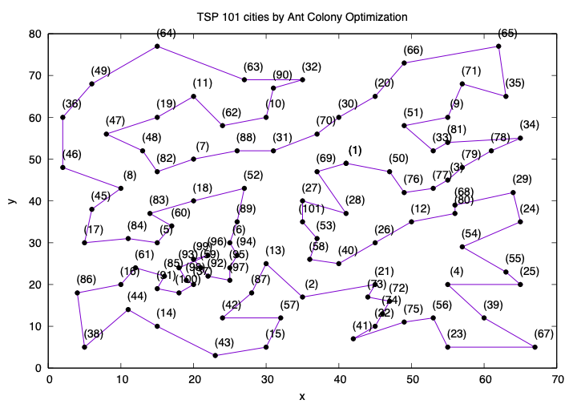

# Ant Colony Optimization

# Traveling Salesman Problem

# Usage

(Only tested under MacOS)
Open terminal

    make
    
1. Run directly in the terminal by typing the following:

        #./main [algo] [runs] [gen] [filename] [population] [alpha] [beta] [rho] [2opt]
        ./main ac 30 1250 "eil51.txt" 30 1 5 0.8 2
        ./main ac 30 1250 "eil101.txt" 30 1 5 0.8 2
        
PS [2opt] : e.g. 2 indicates implements 2opt for every 2 generations. 0 as default which doesn't implement 2opt.
    
2. Or if you want to run multiple times, just by opening the "search.sh" and add whatever you want and run by typing

        ./search.sh
    in the terminal.
 
 
# Results
## eil51
best route: 430.396
This was found among 30 runs and the [2opt] was set to 2.

## eil101
best route: 653.338
This was found among 30 runs and the [2opt] was set to 2.

PS There may be chances that you cannot get the same result due to the randomness!

